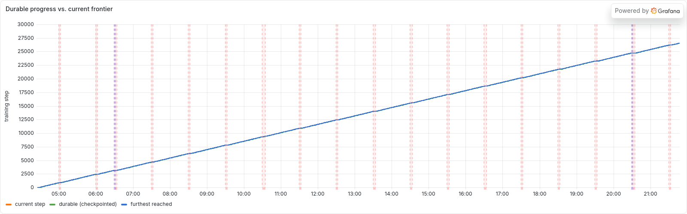
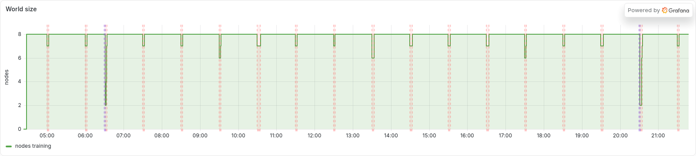
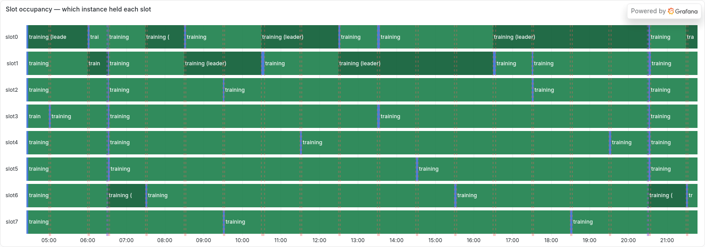
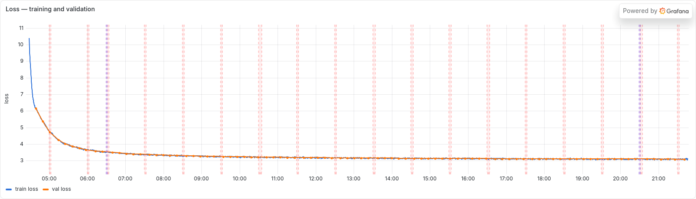
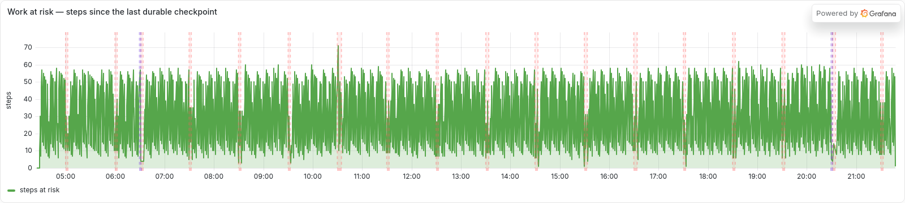

<p align="center">
  
</p>

<p align="center">
  <b>Fault-tolerant distributed LLM training and serving on ephemeral EC2 instances</b>
</p>

<p align="center">
  
  
  
  
  
  
</p>

<p align="center">
  <a href="#headline-result">Headline result</a> ·
  <a href="#tech-stack">Tech stack</a> ·
  <a href="#training-infrastructure">Training infrastructure</a> ·
  <a href="#inference-infrastructure">Inference infrastructure</a> ·
  <a href="#reproducing-this">Reproducing this</a> ·
  <a href="./ROADMAP.md">Roadmap</a>
</p>

---

## The problem

Multi-node training is all-or-nothing by default. A standard `torchrun` job pins
a static world size, and NCCL's collectives require every rank to participate, so
the loss of a single node aborts the entire process group. Recovery means
restarting the whole job from the last checkpoint and discarding every step
computed since it was written.

That failure mode is not exotic. Across a long run, nodes are lost to preemption,
hardware faults, and network partitions, and the probability that *some* node
fails grows with both the node count and the wall-clock duration. The result is a
system whose expected recovery cost scales with the size of the failure, at
exactly the scale where failures become routine.

**The thesis of this project is that recovery cost does not have to scale with
blast radius.** If survivors continue training at a reduced world size while
replacements boot in parallel, then the cost of a failure is bounded by the boot
time of one replacement machine — regardless of whether one node died or six.

The rest of this README is the evidence for that claim.

## Headline result

A single 17.4-hour run trained **GPT-2 124M** on **OpenWebText** across **8 ×
g5.xlarge** (one NVIDIA A10G each) in `us-east-1`, spanning **5 availability
zones**. Over that window the fleet **lost 31 nodes** — including two
catastrophic events that destroyed **6 of 8 nodes at once** — and reached a
validation loss of **3.095** without ever restarting the process group.

<p align="center">
  
</p>

<p align="center"><i>
Training progress over the full run. Every vertical band is a failure event.
The line does not bend at any of them.
</i></p>

| Metric | Value |
|---|---|
| **Model** | GPT-2 124M (12 layers / 12 heads / 768 dim, 124,475,904 parameters) |
| **Dataset** | OpenWebText, 1024-token context |
| **Fleet** | 8 × g5.xlarge (NVIDIA A10G 24 GB), `us-east-1`, 5 availability zones |
| **Wall-clock duration** | 17.41 h |
| **Optimizer steps** | 26,560 |
| **Tokens processed** | 13.05 B (491,520 tokens/step, global batch held constant) |
| **Final validation loss** | **3.095** — also the run's best, over 89 evaluations |
| **Nodes lost** | **31** (mean one loss every 34 minutes) |
| **Replacements launched** | 31 (39 distinct instances held 8 slots) |
| **Catastrophic events** | **2** — world size 8 → 2, recovered in 157 s and 207 s |
| **Whole-group restarts** | **0** |
| **Time at full world size** | **94.14 %** of wall clock |
| **Median recovery to full world** | 167 s (min 148 s, max 299 s, n = 18) |
| **Worst-case work at risk** | 71 steps ≈ 2.1 min of 8-node compute |
| **Aggregate throughput** | 208 K tokens/s sustained; 279 K tokens/s at full world |
| **Control-plane outages survived** | 2 × 106 s, with training unaffected |

Failures in this run were **injected on a schedule** by the supervisor
(`cause: scheduled-kill`) on on-demand instances, which makes the experiment a
controlled and repeatable chaos test rather than an anecdote about one unlucky
day. The recovery machinery does not know why a node stopped answering, so the
measured behaviour is the same as for an involuntary loss.

### The result that matters: recovery is independent of blast radius

Grouping the 18 recovery events by how many nodes were lost simultaneously shows
that losing 6 of 8 nodes cost **no more** than losing 1:

| Nodes lost at once | Events | Median recovery to full world | Worst |
|---|---|---|---|
| 1 of 8 | 13 | 170 s | 299 s |
| 2 of 8 | 3 | 155 s | 218 s |
| **6 of 8** | **2** | **182 s** | **207 s** |

This is the payoff of the design. Recovery time is dominated by how long one EC2
instance takes to boot and join, and replacements boot concurrently, so the curve
is flat in the number of simultaneous failures. A conventional
restart-the-world approach would instead pay the full checkpoint-reload and
re-rendezvous cost on every event, and would forfeit all progress since the last
checkpoint.

<p align="center">
  
</p>

<p align="center"><i>
World size across the run. Shallow notches are single losses; the two deep
notches are the 6-of-8 catastrophes. Recovery is near-vertical in both cases.
</i></p>

<p align="center">
  
</p>

<p align="center"><i>
Per-slot occupancy. Rows are slots, not machines, so 31 replacements do not
become 31 rows. Green is training; the narrow bands are a replacement booting.
Crucially, the other rows stay green throughout — survivors never stop.
</i></p>

<p align="center">
  
</p>

<p align="center"><i>
Training and validation loss. The curve is continuous across all 31 node losses,
which is the real correctness claim: recovery resumes the run rather than
restarting it.
</i></p>

### What keeps the loss curve honest

A system can trivially "survive" preemption by silently losing work or by
changing the effective batch size, and either would corrupt the comparison. Two
invariants prevent that, and both are visible in the data:

- **The global batch is constant.** Gradient accumulation recomputes the
  per-node accumulation factor for each world size, so 480 sequences per
  optimizer step is invariant to membership. The cost appears in step time
  instead: 1,762 ms at 8 nodes versus 1,968 ms at 7 (+12 %, against +14 %
  predicted by the batch redistribution alone).
- **Work at risk is bounded.** Time-based checkpointing caps the number of steps
  that can be lost. Across the run the median exposure was 30 steps and the
  maximum ever reached was 71 — about 2.1 minutes of 8-node compute.

<p align="center">
  
</p>

Additional exported panels: [step time](./docs/img/flagship-steptime.png) ·
[cumulative losses and replacements](./docs/img/flagship-losses.png) ·
[control-plane liveness](./docs/img/flagship-supervisor.png).

## Tech stack

| Layer | Technologies |
|---|---|
| **Model & training** | PyTorch 2.x, DDP over NCCL, `torchrun`, bf16 autocast, gradient accumulation, [nanoGPT](https://github.com/karpathy/nanoGPT) (pinned submodule, read-only) |
| **Control plane** | Python 3.10+, boto3, systemd; a pure-reducer supervisor with S3 as the coordination bus |
| **Cloud** | AWS EC2 (g5 / A10G), S3, IAM instance profiles, SSM Session Manager, Lambda |
| **Serving** | FastAPI + Uvicorn workers; router in both Python and Go (`aws-sdk-go-v2`); OpenAI-shaped API |
| **Containers & orchestration** | Docker, Kubernetes (k3d / k3s) |
| **Observability** | Prometheus, Grafana (provisioned dashboards, server-side PNG rendering), Weights & Biases |
| **Load & chaos testing** | Purpose-built Go load generator that kills workers mid-test |
| **Engineering quality** | pytest (614 tests), ruff, `go vet` / `go test -race`, pre-commit hooks |

## Training infrastructure

Membership is owned by a **single writer**. The supervisor publishes monotonically
numbered *epoch documents* to S3; every box runs a sidecar that reads them and
launches a **static** `torchrun` for the world described. No node hosts a
rendezvous store, which is what makes every node — including the master —
safely killable.

```
                    ┌──────────────────────────────────────────┐
  CONTROL PLANE     │  EPOCH SUPERVISOR                        │
  (on-demand        │  on a t3.micro — never preemptible       │
   t3.micro)        │                                          │
                    │  decide(Observation, Policy) -> [Action] │
                    │            ^ pure reducer, table-tested  │
                    └───────────────────┬──────────────────────┘
                                        │ single writer
                                        ▼
                    ┌──────────────────────────────────────────┐
  COORDINATION      │  S3   runs/<run_id>/                     │
  (S3 as the bus)   │    epoch.json      membership authority  │
                    │    checkpoints/    async rank-0 tier     │
                    │    status/         per-node heartbeats   │
                    └───────────────────┬──────────────────────┘
                                        │ polled by every box
          ┌──────────────┬──────────────┼──────────────┬──────────────┐
          ▼              ▼              ▼              ▼              ▼
     ┌─────────┐    ┌─────────┐    ┌─────────┐    ┌─────────┐    ┌─────────┐
     │ sidecar │    │ sidecar │    │ sidecar │    │ sidecar │    │ sidecar │
     ├─────────┤    ├─────────┤    ├─────────┤    ├─────────┤    ├─────────┤
     │ static  │    │ static  │    │ static  │    │ static  │    │ static  │
  ───│torchrun │────│torchrun │────│torchrun │────│torchrun │────│torchrun │───
     │  DDP    │    │  DDP    │    │  DDP    │    │  DDP    │    │  DDP    │
     └─────────┘    └─────────┘    └─────────┘    └─────────┘    └─────────┘
      g5.xlarge      g5.xlarge      g5.xlarge      g5.xlarge      g5.xlarge
       + A10G         + A10G         + A10G         + A10G         + A10G
     local NVMe     local NVMe     local NVMe     local NVMe     local NVMe
      ckpt tier      ckpt tier      ckpt tier      ckpt tier      ckpt tier
          └──────────────┴──────────────┴──────────────┴──────────────┘
                      NCCL all-reduce  (gradient synchronisation)
```

**The failure path, end to end.** A node stops heartbeating; the supervisor
observes the gap and publishes epoch *N+1* naming the survivors; sidecars on the
survivors restart `torchrun` at world size *N−k* and resume from the node-local
checkpoint within seconds; concurrently the supervisor launches a replacement.
When that box boots it pulls the latest checkpoint from S3, and the supervisor
publishes epoch *N+2* restoring the full world.

Four design decisions make that path safe:

- **One resume code path.** Startup always attempts to restore the latest
  checkpoint and falls back to fresh. There is never a separate "resume" branch
  to drift out of sync with the normal one.
- **Checkpoint everything that affects the next step** — weights, optimizer
  state, step number, remaining time budget, **all RNG states**, and the
  **data-loader position**. The last two are what stop a resumed run from
  silently diverging onto a different trajectory.
- **Two-tier checkpoints.** A step-aligned node-local tier on NVMe gives
  survivors near-instant restores; an asynchronous rank-0 tier in S3 serves
  replacements. A group-MIN agreement decides the step everyone resumes from.
- **Atomic writes.** Checkpoints are written to a temporary key and atomically
  renamed, so a kill during a write cannot corrupt the last good checkpoint.

The supervisor's decision core is a pure function, `decide(Observation, Policy)
-> [Action]`, which means the entire membership policy is table-tested offline
and the whole protocol runs on localhost in `tests/test_epoch_e2e.py` with real
sidecars and real `torchrun` — no cloud resources required to exercise it.

> This design replaced an earlier `torchrun`-elastic approach using c10d dynamic
> rendezvous. That version passed every local test on torch 2.4 and then hung for
> more than 180 s on the DLAMI's torch ≥ 2.8. A version-dependent black box is a
> poor foundation for a fault-tolerance story, so membership moved into code we
> own and can log. Full rationale: [docs/multinode-design.md](./docs/multinode-design.md).

## Inference infrastructure

The serving fleet applies the same principle to a different workload: **workers
are disposable and the router is the only stable component.** A worker that
disappears needs no cleanup — its heartbeat goes stale, it leaves the rotation
within the TTL, and its in-flight requests are re-dispatched elsewhere.

```
                                 client
                                   │  POST /v1/completions
                                   ▼
                 ┌─────────────────────────────────────┐
                 │  ROUTER — the fleet's one stable    │   Go or Python,
                 │  (on-demand) component              │   identical contract:
                 ├─────────────────────────────────────┤   same endpoints,
                 │  round-robin over the LIVE set      │   env vars, port and
                 │  reroute on: connect error · 5xx    │   Prometheus metrics
                 │  pass through: 4xx (client's fault) │
                 │  bounded attempts · 3 s connect TO  │
                 │  GET /metrics  → Prometheus         │
                 └───────┬─────────────────────────────┘
                         │ dials addresses from a registry
                         │ snapshot, re-polled every 3 s
      ┌──────────────────┼──────────────────┬──────────────────┐
      ▼                  ▼                  ▼                  ▼
 ┌──────────┐       ┌──────────┐       ┌──────────┐       ┌──────────┐
 │ worker 1 │       │ worker 2 │       │ worker 3 │       │ worker 4 │
 ├──────────┤       ├──────────┤       ├──────────┤       ├──────────┤
 │ GPT-2 +  │       │  bf16 /  │       │ FastAPI  │       │ heartbeat│
 │ BPE      │       │  fp16    │       │ +uvicorn │       │  every 5s│
 └────┬─────┘       └────┬─────┘       └────┬─────┘       └────┬─────┘
      │                  │                  │                  │
      └──────────────────┴────────┬─────────┴──────────────────┘
                                  │ overwrite <workers_uri>/<id>.json
                                  ▼
                 ┌─────────────────────────────────────┐
                 │  REGISTRY  (S3 prefix or local dir) │
                 │  a worker is live iff last_seen is  │
                 │  within the TTL (15 s ≈ 3 beats)    │
                 └─────────────────────────────────────┘
```

Using the object store as the registry means the fleet needs no new IAM
permissions, no consensus service, and no extra failure domain — and its entire
state is inspectable with `aws s3 ls`.

### Optimizations and design decisions

- **Serving dtype is chosen per device.** Weights are cast to bf16 on Ampere and
  newer, fp16 on older cards, and fp32 on CPU so local tests stay exact.
  Inference here is memory-bandwidth bound, so this roughly doubles tokens/s and
  halves VRAM (gpt2-xl: 6.2 GB → 3.1 GB).
- **The routing decision is a pure function.** `route_completion` takes the
  upstream POST as an injected interface, so the full policy table — success on
  first try, reroute on transport error, reroute on 5xx, 4xx passed through
  untouched, bounded attempts, round-robin spread, 503 when all workers are dead
  — is unit-tested without opening a socket. Both the Python and Go routers are
  tested this way.
- **Connection reuse is off by default, deliberately.** A pooled connection to a
  just-terminated box has no SYN to time out, so it hangs for the full 60 s read
  window instead of failing fast on the 3 s connect timeout — precisely the case
  this fleet exists to survive. It is opt-in
  (`ROUTER_UPSTREAM_KEEPALIVE`) for stable-fleet throughput runs.
- **A client disconnect stops the retry loop.** Otherwise a single abandoned
  request fans out across every worker and records failures against healthy
  boxes, skewing the measurements the fleet exists to produce.
- **The serving path does not import the training tree.** A dedicated model
  builder avoids pulling in the distributed, event, and interruption modules to
  reach a fourteen-line function — which is container bloat and cold-start
  latency on a metric we intend to measure.
- **Metrics are identical across both routers** — same names, labels, help
  strings, and histogram buckets, with buckets chosen for token generation
  rather than Prometheus' sub-250 ms web defaults. One Grafana dashboard serves
  both, which is what makes an apples-to-apples A/B possible.
- **Queue depth is exported per worker** as the intended autoscaling signal, and
  worker gauges are cleared on each registry sweep so a dead worker cannot pin
  an autoscaler at a stale value.

### Measured serving results

Each row is an experiment with its own writeup, method, and validity section.

| Result | Measurement | Writeup |
|---|---|---|
| **Go router vs Python** | Go sustains **7,000 rps to Python's 750 — 9.3× the throughput** — and adds **~3× less latency** per request at matched load | [x2-x3-results.md](./docs/experiments/x2-x3-results.md) |
| **Router equivalence** | The two routers are functionally identical under the same policy table, so the A/B compares implementations rather than behaviour | [x2-x3-results.md](./docs/experiments/x2-x3-results.md) |
| **KV cache** | **2.3× → 3.5× faster**, with the gap widening as output length grows, exactly as theory predicts | [hf-kv-results.md](./docs/experiments/hf-kv-results.md) |
| **Backend equivalence** | The HF backend is **token-for-token identical** to nanoGPT across 3 prompts × 32 tokens — equivalent, not merely similar | [hf-kv-results.md](./docs/experiments/hf-kv-results.md) |
| **Kubernetes failure detection** | **0.83 s graceful / 4.65 s abrupt** via readiness probes, against **13 s** for heartbeat expiry | [p3-k3d-results.md](./docs/experiments/p3-k3d-results.md) |
| **Single-GPU serving** | gpt2-xl bf16 on one A10G: L0 **2,097 ms** p50 at 64 tokens, **30.5 tok/s** decode — **4.6× off** the memory-bandwidth bound, so most of it is overhead rather than compute | [e1e2-results.md](./docs/experiments/e1e2-results.md) |

The last row is the honest one: the naive serving path is **4.6× slower than
the hardware allows**, which is what motivated the KV-cache backend and the vLLM
work now landed in `src/inference/backends.py`. Node-level failure on
Kubernetes is roughly **8× slower** to react to than pod-level failure
([p33-results.md](./docs/experiments/p33-results.md)) — the same
detection-versus-recovery distinction the training side had to solve.

## Reproducing this

Everything in this section runs on a laptop CPU and provisions nothing.

```bash
git clone --recurse-submodules https://github.com/miguelaenlle/OptiTrain.git
cd OptiTrain
pip install -e ".[dev,fleet]"        # add ",viz" for W&B + timeline plots
```

Already cloned without submodules? Run `git submodule update --init`.

**The full suite** — 610 passing on a clean clone, no AWS calls and no GPU
(4 skips: DDP fork on macOS, plus two fixtures needing local run artifacts):

```bash
pytest -q
```

**The core correctness invariant.** A killed-and-resumed run must continue along
the same loss trajectory as an uninterrupted one, and that is deliberately
testable before any instance is launched:

```bash
pytest tests/test_kill_resume.py -v
```

**The entire multi-node protocol on localhost** — real sidecars, real epoch
documents, real static `torchrun`:

```bash
pytest tests/test_epoch_e2e.py -v
```

**An inference fleet as local processes**, then a load test that kills a worker
mid-flight:

```bash
spot-orchestrate fleet up --local --workers 2
cd loadgen && go run . -url http://localhost:8000 -rps 20 -duration 60s \
  -kill-after 20s -kill-cmd "spot-orchestrate fleet kill-worker --local"
```

**The dashboard the figures above came from.** This run's exported series are
committed under `deploy/grafana/data/`, so the stack comes up populated with real
data and nothing needs to be re-derived:

```bash
cd deploy/grafana && docker compose up -d     # http://localhost:3001
```

The same stack renders the figures in this README server-side, so the published
images and the live dashboard cannot drift apart.

### Running on AWS

> [!WARNING]
> **The commands in this section launch real EC2 instances and incur real
> charges.** Every one of them accepts `--dry-run`, which logs each AWS call and
> launches nothing. Use it first.

Prerequisites are AWS credentials resolvable by boto3 (an SSO profile is
recommended), a `.env` created from `.env.example` with a bucket you own, and a
G-class quota increase — fresh accounts sit at zero and approval can take days.

```bash
spot-orchestrate setup                       # idempotent: bucket, IAM, SG
DATASET=openwebtext spot-orchestrate stage-data --remote
spot-orchestrate multinode-preempt           # N-node run with a kill schedule
spot-orchestrate compare <run_id>...
```

A multi-day run should not depend on a laptop staying awake. `orch up` puts the
control plane on an always-on `t3.micro`, runs the experiment there under
systemd, and attaches your terminal to a live dashboard that `Ctrl-C` merely
detaches from:

```bash
spot-orchestrate orch up --experiment multinode --env NODES=8
spot-orchestrate orch status
spot-orchestrate orch down --all
```

It authenticates with an instance-profile role, so no keys are copied and nothing
expires mid-run, and it restarts the experiment on crash while resuming the same
`run_id`. Training boxes expose **no inbound ports**; operator access is via SSM
Session Manager.

## Repository layout

```
src/spot_train/     the trainer — one resume path, wall-clock budget, checkpointing
  train.py            entrypoint: restore-or-fresh, time budget, eval, metrics.json
  checkpoint.py       full-state save/restore + verify() + post-save smoke test
  s3_store.py         local and S3 behind one interface; atomic rename, SHA-256
  rng.py / data.py    RNG capture-restore; memmap batches + loader position
src/orchestrator/   the control plane (boto3)
  aws.py              the ONLY module that calls AWS; every call logs, honors --dry-run
  supervisor.py       epoch supervisor: pure decide() reducer + effects loop
  sidecar.py          per-box: obey epoch.json, run static torchrun per epoch
  orch.py             durable remote orchestrator (up / status / logs / down)
src/inference/      serving fleet: worker, router, heartbeat registry
router-go/          Go rewrite of the router — 9.3x the Python throughput
bench/              benchmark harness: L0, the SLO, the knee C1, scaling efficiency
loadgen/            Go load generator and chaos harness (own go.mod)
deploy/             Dockerfiles, k3d/k3s manifests, AWS rigs, monitoring stack
third_party/        nanoGPT as a pinned submodule — we import the model, not rewrite it
docs/               design notes, experiment writeups, IAM policies, runbooks
tests/              614 tests — checkpoint/resume, supervisor, sidecar, fleet,
                    router policy, and the multi-node protocol end-to-end
```

## Design principles

These are load-bearing; changes that violate them are rejected.

1. **Don't write the model.** This project owns the fault-tolerance layer, not
   the transformer. nanoGPT is a pinned, read-only submodule.
2. **One resume code path.** Restore-latest-or-fresh, never two branches.
3. **Determinism first.** Kill-and-resume must pass locally on CPU before it goes
   near a cloud instance, because determinism is miserable to debug on a machine
   that is disappearing.
4. **Checkpoint everything that affects the next step**, including RNG states and
   data-loader position.
5. **Atomic writes.** Temporary key, then rename.
6. **Assume no warning.** Poll IMDS and handle SIGTERM, but checkpoint on a timer
   regardless, because some terminations give no notice at all.
7. **Measure, don't predict.** Every claim in `docs/` cites a run id and a
   validity section, and predictions that missed are recorded next to the ones
   that landed.

## Experiment writeups

Each writeup states the question, the runs that answered it, and the validity
threats considered.

| Experiment | Question | Writeup |
|---|---|---|
| **E1** | Can checkpointing be made cheap enough to ignore? | [e1-results.md](./docs/e1-results.md) |
| **E2** | Why do survivors idle while a replacement boots? | [e2-results.md](./docs/e2-results.md) |
| **E2b** | Do survivors now train *through* a failure? | [e2b-results.md](./docs/e2b-results.md) |
| **E4** | Does recovery cost grow with the number of failures? | [e4-results.md](./docs/e4-results.md) |

## A note on regions

This AWS account is shared with a separate inference platform that owns
**us-east-2**. Training is pinned to **us-east-1**, and `aws.set_region()` raises
on anything else. Isolation is by region because GPU quota is per-region, so
neither project can starve the other, and a careless `describe-instances` in one
cannot even see the other's machines. Full contract:
[docs/region-split.md](./docs/region-split.md).

## Documentation

| Document | Contents |
|---|---|
| [ROADMAP.md](./ROADMAP.md) | The plan of record — inference fleet, RL finetuning, unified platform |
| [docs/multinode-design.md](./docs/multinode-design.md) | The epoch-supervisor protocol in full |
| [docs/checkpoint-tiers.md](./docs/checkpoint-tiers.md) | How the two checkpoint tiers interact |
| [docs/gpt2-reproduction.md](./docs/gpt2-reproduction.md) | Scaling to a GPT-2-class run; the streaming data plane |
| [docs/backlog.md](./docs/backlog.md) | Known gaps, each with a cost and a reason |
| [docs/iam/](./docs/iam/) | Least-privilege policies per principal |
| [CLAUDE.md](./CLAUDE.md) | Working guidance, phase history, conventions |

## License

MIT — see [LICENSE](./LICENSE). nanoGPT is vendored as a submodule under its own
MIT license.
