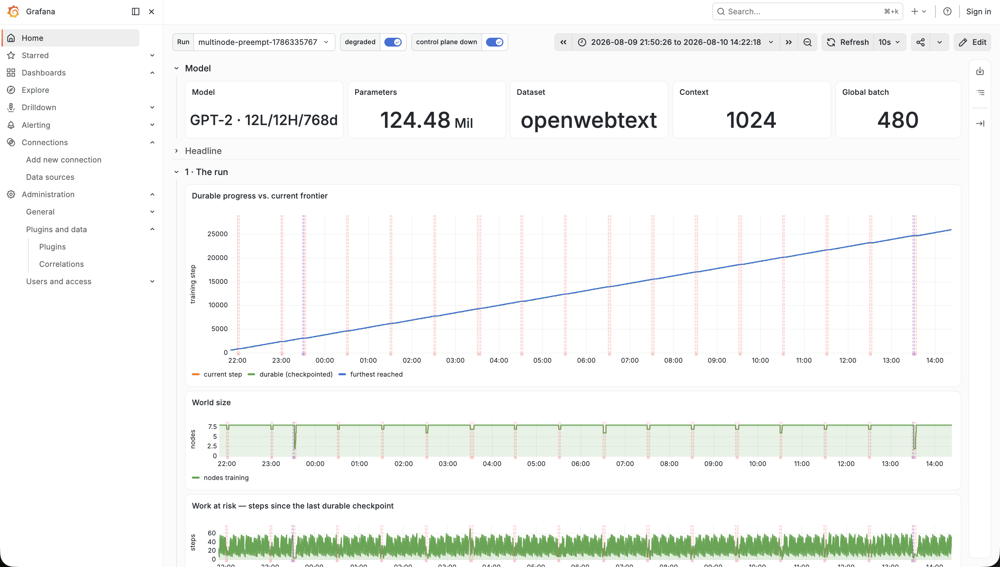
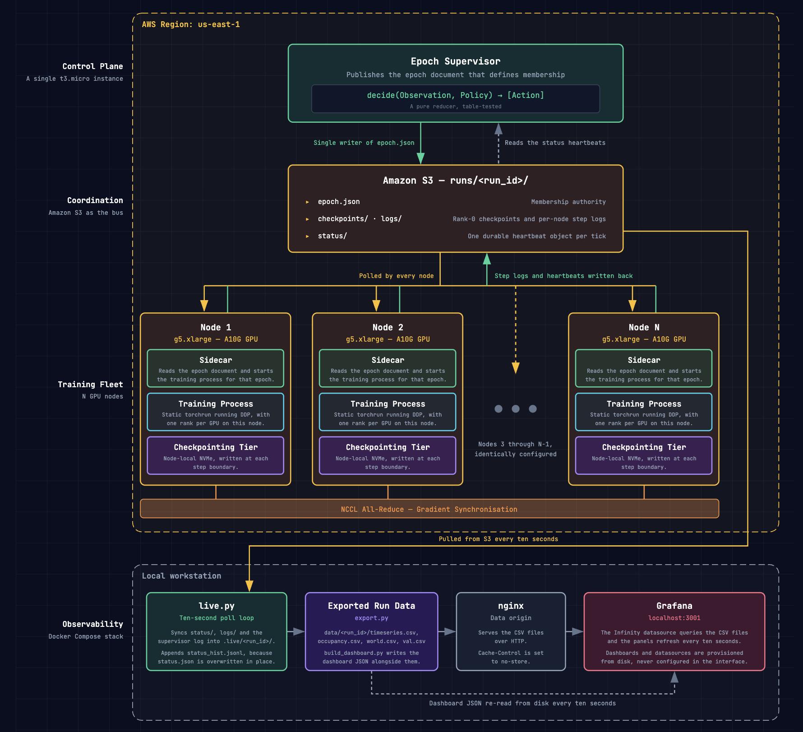
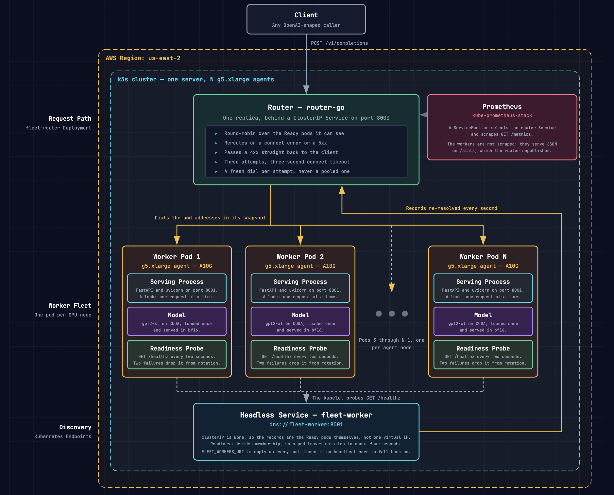

# OptiTrain

*Fault-tolerant distributed LLM training and serving on ephemeral GPU instances.*

## Overview

OptiTrain is a custom-built, fault-tolerant distributed LLM training and
inference engine designed to sustain workloads on highly ephemeral GPU clusters.

### Key Capabilities

- **Elastic Scaling:** Compute instances can seamlessly join or leave the
  training and inference clusters without interrupting active workloads.
- **Fault Tolerance:** Recovers dead nodes in ~10 seconds utilizing a
  lightweight supervisor and two-tier weight checkpointing.
- **Real-Time Observability:** Tracks cluster health, training progress, and
  latency via a Prometheus and Grafana stack.

### Performance

- **Resilient Training:** Survived 31 injected node failures—including 6
  simultaneously crashing—throughout a 17-hour cross-AZ continuous GPT-2 124M
  training run across 8 AWS GPU instances.
- **High-Throughput Serving:** Custom Go/Kubernetes routing plane sustains
  7,000 RPS (a 9.3× throughput increase over the Python baseline) with 3× lower
  latency.
- **Hardware Efficiency:** Achieved 34x throughput and halved the VRAM footprint
  over vanilla Hugging Face model serving using vLLM continuous batching, KV
  caching, and dynamic datatype casting (bf16, fp16, fp32).

*Built as a solo project to learn more about distributed training and ML
systems.*

## Benchmarks

### Training: 17-hour Chaos Test

A continuous GPT-2 124M training run injected with 31 scheduled node failures to
validate system resilience.

| Metric | Result |
|---|---|
| Model | GPT-2 124M |
| Dataset | OpenWebText |
| Training Time | 17.4 hours |
| Training Loss | 10.40 to 3.10 |
| Fleet | 8x g5.xlarge training instances (NVIDIA A10G) 5 Availability Zones within us-east-1 |
| Failures Survived | 31 (~1 every 34 minutes) |
| Catastrophic Events (6/8 nodes destroyed simultaneously) | 2 |
| Median Recovery Time (Time to restore full 8-node world) | 167s |

*Red regions: One or more nodes were down* 
*Despite failures, the system self-healed and continued training throughout the
run.*

*The furthest achieved training step continually increased throughout the run,
rapidly recovering from the durable, checkpointed step after every failure.*

<em>Per-slot occupancy throughout the run, 8 in total. 
Red regions: One or more nodes failed 
Blue: node is being replaced 
Green: Node is training/healthy</em>

### Inference: High-Throughput Serving

Ephemeral workers managed by a stable routing plane.

- **9.3× Throughput:** Custom Go router sustains **7,000 RPS** vs. Python's 750
  RPS, with 3x lower latency.
- **Hardware Efficiency:** Dynamic datatype casting (bf16, fp16, fp32) halves
  VRAM footprint and doubles generation speed.
- **KV Cache Optimization:** Delivers up to a 34x throughput optimization for
  long-context generation relative to the vanilla Hugging Face model.

## System Architecture

### Distributed Training Plane

- **Supervisor:** A lightweight control plane monitors heartbeats and publishes
  monotonically numbered "epoch documents" to S3.
- **Stateless Sidecars:** GPU instances run sidecars polling S3. On failure, the
  supervisor updates the epoch, and sidecars dynamically restart `torchrun` at
  the new world size.
- **Two-Tier Checkpointing:** Local NVMe tier for instant survivor restarts;
  asynchronous S3 tier to initialize fresh replacements.

### Resilient Inference Plane

- **Stable Router:** The only permanent component. Round-robins requests across
  the live set; reroutes automatically on 5xx or transport errors.
- **S3 Registry:** Workers publish 15s TTL heartbeats to S3. Stale nodes are
  silently dropped from rotation without complex consensus protocols.
