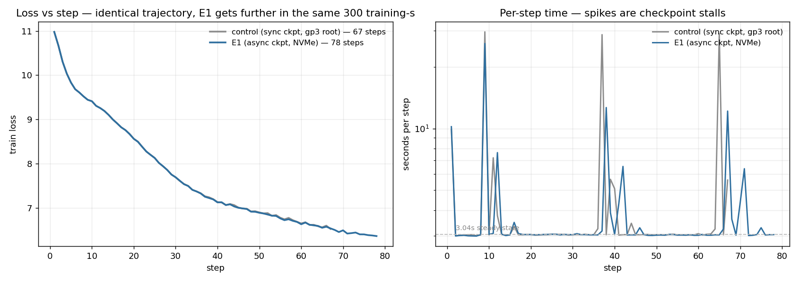

# E1 — async node-local checkpointing + NVMe placement

**Verdict: real improvement (+16% steps, −43% stall per step), but FAILS the ≥90-step gate.**
Diagnosed: rank 0 still performs **two** synchronous GPU→CPU copies per checkpoint.

Branch `phase1/gpt2-owt-baseline` @ `cfc1b5a`. 4 nodes, 300s training budget, ~$0.75.

## Results

| metric | control | E1 | gate | verdict |
|---|---|---|---|---|
| run_id | `multinode-1786117954` | `multinode-1786164581` | | |
| **steps in 300 training-s** | 67 | **78 (+16%)** | ≥90 | ❌ **FAIL** |
| stall per step | 1.47s | **0.83s (−43%)** | — | ✅ |
| stall as % of training | 32.6% | **21.5%** | — | ✅ |
| `final_saves_s` | 108.2s | **81.3s (−25%)** | <30s | ❌ |
| max step time | 29.6s | 26.0s | <6s | ❌ |
| median step time | 3.036s | 3.038s | unchanged | ✅ |
| `trained_seconds_total` | 301.71 | 302.03 | ~300 | ✅ A/B valid |
| val_loss | 6.527 @ 67 | 6.3675 @ 78 | no divergence | ✅ |

**NVMe placement confirmed live on the box:**
`LOCAL_CHECKPOINT_DIR=/opt/dlami/nvme/spot-train-data/spot-ckpt`

## Charts



`docs/img/e1-comparison.png`

- **Left — loss vs step:** the two curves lie exactly on top of each other. That is
  the correctness result: async checkpointing did not perturb training at all;
  E1 simply travels further along the same trajectory in the same 300 training-s.
- **Right — per-step time (log scale):** the spikes are checkpoint stalls. The
  control's peaks are taller (~29s); E1's are lower but more numerous, because
  E1 completes more steps and therefore checkpoints more often within the budget.

## W&B

- control — https://wandb.ai/bot-developer3-Miguel%20Aenlle/spot-train/runs/k34qpxws
- **E1** — https://wandb.ai/bot-developer3-Miguel%20Aenlle/spot-train/runs/zxk2nzeo
- project — https://wandb.ai/bot-developer3-Miguel%20Aenlle/spot-train

## Why it fell short

Rank 0 takes **two full 1.5 GB device→host snapshots per checkpoint**:

```python
# S3 tier — snapshot() happens INSIDE submit(), synchronously
async_ckpt.submit(model=raw_model, optimizer=optimizer, ...)

# node-local tier — a SECOND, separate snapshot of identical state
blob = checkpoint.snapshot(model=raw_model, optimizer=optimizer, ...)
async_local.submit(blob, step)
```

`train.py` even carries the stale assumption: *"(Rank 0 snapshots twice — a
second ~tens-of-ms CPU copy.)"* That was true for the Shakespeare model. At
GPT-2 124M each snapshot is ~450 unbatched `.to("cpu", copy=True)` calls, and
**every one synchronises against a GPU busy with queued training kernels** —
which is how ~250ms of raw PCIe bandwidth turns into seconds.

So Fix 1 removed the *write* from the critical path and left the *copy*. The copy
is now the entire remaining cost.

## Follow-ups, in order

1. **Snapshot once, share the blob.** Rank 0 takes one D2H copy and hands the same
   dict to both writers. They are identical by construction — same model,
   optimizer, step, and instant. Should roughly halve the residual on rank 0.
   Small change.
2. **Batch the D2H into a pinned buffer.** Kills the ~450 per-tensor syncs. This is
   the pinned-memory work originally deferred as unmeasured; it is now measured
   and justified.

Estimate: (1) alone should land near ~90 steps; (1)+(2) near the ~100 originally
predicted.

## Validity

- `trained_seconds_total` 301.71 vs 302.03 — both ~300s, A/B valid
- identical recipe, node count, checkpoint interval (30s in both arms)
- loss curves superimpose → no divergence from async writes
- fleet terminated, 0 instances billing

## Artifacts

- `s3://<bucket>/runs/multinode-1786117954/` — control profile/metrics/logs
- `s3://<bucket>/runs/multinode-1786164581/` — E1 profile/metrics/logs
- `.context/e1/png/e1-comparison.png`
- `.context/e1/run.log` — driver log
