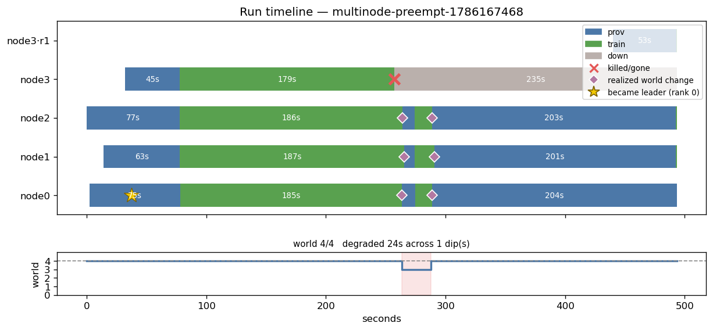
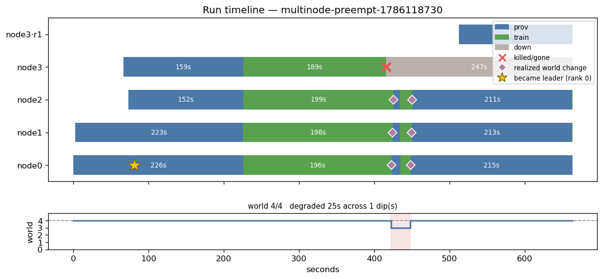

# E2 — stop idling survivors while a replacement boots

**Verdict: half the fix works, the half that mattered does not. Root cause found;
the real fix is a two-line identity check, staged but not yet run.**

4 nodes, 300s training budget, one worker killed at t+120s. ~$1.15.
Control: `multinode-preempt-1786118730` · E2: `multinode-preempt-1786167468`

## The diagram — this is the whole result

**E2 (after the fix):**



**Control (before):**



Read the survivor rows (node0–node2). Two diamonds — "realized world change" —
sit almost on top of each other with a **sliver of green** between them, then a
**200-second blue bar** to the end of the run. Blue is `prov`: booted, idle, not
training. That bar is three nodes doing nothing while one replacement boots.

The world track underneath says `degraded 24s across 1 dip`. The dip is supposed
to be the *whole* window during which survivors carry the run. It is 24 seconds
out of a 235-second outage.

**The two timelines are the same shape.** That is the finding.

## Numbers

| | control | E2 |
|---|---|---|
| kill detected | t+422.6s | t+263.6s |
| survivors training at world 3 | t+434.5s | t+274.5s |
| **regrow published** | t+448.0s | **t+288.7s** |
| replacement begins booting | t+512.3s | t+439.8s |
| world 4 restored | t+662.7s | t+493.3s |
| **survivors idle after regrow** | **214s** | **204.5s** |
| **steps at reduced world** | 3 | **3** |
| resume point, both restarts | step 37 | **step 36** |
| steps / val_loss | 75 / 6.4152 | 74 / 6.4254 |
| `trained_seconds_total` | 327.2 | 303.7 |

Gate was **≥15 banked steps at `ws 3`**. Got 3, and both resumes restored from the
same pre-kill step — so every reduced-world step was discarded, exactly as in the
control.

- E2 — https://wandb.ai/bot-developer3-Miguel%20Aenlle/spot-train/runs/a8oleffg
- control — https://wandb.ai/bot-developer3-Miguel%20Aenlle/spot-train/runs/z1hopxuc

## What DID work: registration now means "I can train"

```
[data] fetched train.bin (17,234.0 MB) in 116.5s
[epoch] node 3: dataset ready in 118.1s (pre-register)
[epoch] node 3: registered ip=... instance=...
```

The replacement pulled the corpus *before* announcing itself, and the payoff is
visible on the timeline: `node3·r1` goes from announcement to training in **53s**,
against ~150s in the control. Same total work, moved ahead of the announcement.

That half is worth keeping regardless of what happens next.

## Why the idle window survived: the fix was a no-op

`_terminate` now clears the dead node's cached IP. But registration is **durable
in S3**, and `_node_ip` falls through to it on a cache miss:

```python
if node in self.st.ips:
    return self.st.ips[node]
raw = s3_store.read_bytes(self.cfg.run_node_uri(self.run_id, node))   # the DEAD node's doc
```

`nodes/node3.json` is keyed by node **index** and was written by the original
occupant at boot. Clearing the in-memory cache merely forced a re-read of that
same file, so the slot read as registered again within one tick — and
`_healthy()` passed it, because EC2 still said `running` and the log was only
seconds old. The reducer regrew onto a corpse at t+288.7s while the replacement
had not started booting until t+439.8s.

## The real fix (staged, uncommitted, unrun)

The node doc already carries `instance_id`, and the supervisor already tracks
which instance occupies each slot (`node_ids[node]`). A registration should only
count if the box that wrote it is the box now in the slot:

```python
expected = self.node_ids.get(node)
got = doc.get("instance_id")
if expected and got and got != "unknown" and got != expected:
    return None          # stale registration from a previous occupant
```

Self-correcting, no deletion race, and the replacement becomes registered
naturally when it writes its own doc. `"unknown"` is the localhost-E2E case where
IMDS is unavailable.

Expected effect: regrow moves from t+288.7s to ~t+440s, so survivors train at
world 3 for ~175s instead of 24s.

## The second problem this exposes

Even with a ~175s window, reduced-world work may still be discarded. Both resumes
here restored from step 36 because **no checkpoint landed while the world was
short-handed** — the 24s window never outlived the 30s checkpoint interval. A
175s window would cross it, but relying on that is luck.

The durable fix is **checkpoint-on-membership-change**: write one checkpoint
before publishing the regrow epoch, so reduced-world work banks regardless of
window length. Currently in `docs/backlog.md`.

## Honest accounting

Three predictions about this system have now been wrong: E1 (≥90 steps, got 78),
E1b (~100, got 81), and E2 (the IP-clearing fix, which changed nothing). The
pattern is that I have been reasoning from the code's *intent* rather than
measuring what it does. The identity check above is derived from an observed
mechanism — an S3 read repopulating a cache I had just cleared — rather than
from a model of how it ought to behave, which is a better basis but still
unproven until it runs.

## Validity

- `trained_seconds_total` 327.2 vs 303.7 — both near the 300s budget
- identical recipe, node count, checkpoint interval; `LOG_INTERVAL_STEPS=1`
- `resumed=True`, `restart_count=0`, no whole-group restart in either arm
- reduced-world counts read from raw node logs, not `profile.json` (which dedupes
  by step and silently drops rolled-back work)
- fleet terminated after each run, 0 instances billing
