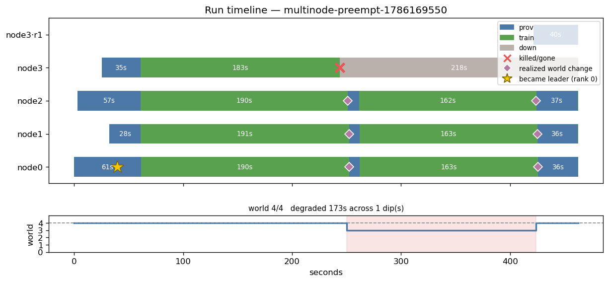

# E2b — survivors now train through a failure

**Verdict: PASS. Every gate met.** One node failure now costs **31% less wall
clock and 29% less money** than before, because the three survivors keep training
instead of blocking in NCCL waiting for a node that does not exist yet.

4 nodes, 300s training budget, one worker killed at t+120s. Fix: `35c325f`.
Run `multinode-preempt-1786169550` · ~$0.79.

## The diagram

**E2b — after the fix:**



**Before (E2 / control had the same shape):**


Same rows, same kill, completely different middle. Survivors used to get a
**sliver of green between two diamonds, then a ~200s blue bar**. Now they get a
**162–163s green block** — training at world 3 for the whole outage — and only
~36s of blue at the end while the replacement joins.

The world track tells it in one line: **`degraded 173s across 1 dip`**, against
`degraded 24s` before. The dip is now the width of the actual outage, which is
what "elastic" was always supposed to mean.

## Results

| | control | E2 | **E2b** |
|---|---|---|---|
| run_id | `…1786118730` | `…1786167468` | `…1786169550` |
| **wall clock** | 981.5s | 970.7s | **678.7s (−31%)** |
| **cost** | $1.126 | $1.108 | **$0.794 (−29%)** |
| **steps at reduced world** | 3 | 3 | **31** |
| **survivor idle after regrow** | 214s | 204.5s | **36s (−83%)** |
| degraded window | 24s | 24s | **173s (7.2×)** |
| regrow published | t+448s | t+288.7s | **t+425.8s** |
| replacement registers | — | t+439.8s | t+421.8s |
| steps / val_loss | 75 / 6.4152 | 74 / 6.4254 | 74 / 6.4432 |
| `trained_seconds_total` | 327.2 | 303.7 | 299.0 |
| `resumed` / `restarts` | True / 0 | True / 0 | True / 0 |

Gates: **≥15 banked steps at `ws 3`** → 31 ✅ · **idle < 60s** → 36s ✅ ·
**wall ≤ 850s** → 678.7s ✅ · no whole-group restart ✅

- E2b — https://wandb.ai/bot-developer3-Miguel%20Aenlle/spot-train/runs/49gdomnb
- E2 — https://wandb.ai/bot-developer3-Miguel%20Aenlle/spot-train/runs/a8oleffg
- control — https://wandb.ai/bot-developer3-Miguel%20Aenlle/spot-train/runs/z1hopxuc

## The work is banked, not just performed

This was the open question — E2 showed survivors *could* train at reduced world,
but every step was discarded. The resume points settle it:

```
[resume] restored from step 39 (140s already trained)     <- shrink to world 3
[resume] restored from step 68 (278s already trained)     <- regrow: step 68, NOT 39
```

The regrow resumed from **step 68**, so the ~29 steps completed at world 3 were
checkpointed and kept. Previously **both** resumes restored from the same
pre-kill step and the reduced-world work was thrown away.

**`checkpoint-on-membership-change` is therefore not needed** — with a 173s
window the normal 30s checkpoint interval fires several times, so the work banks
on its own. Removed from the backlog as unnecessary; re-open only if a future
degraded window is shorter than the checkpoint interval.

## Why total steps did not change (and why that is fine)

All three runs did ~74 steps, because all three trained ~300 *training-seconds* —
that is the budget. The fix does not create training time, it **stops wasting
wall clock**:

- before: survivors idled 214s while the replacement booted. Idle time is not
  training time, so the run needed 981s of wall clock to spend its 300s budget.
- after: survivors train during that window at world 3 (~4.1s/step vs 3.0s at
  world 4 — gradient accumulation holds the global batch at 480, so a smaller
  world just does more micro-batches). The 300s budget is spent in 679s of wall
  clock instead.

**Same work, 5 minutes less wall clock, 29% less money.** On a fixed-step budget
rather than a fixed-time one, the same fix would show up as more steps instead.

## The fix

A dead node's registration must not outlive it. `nodes/node<i>.json` is keyed by
node **index** and persists in S3, so after a kill the dead occupant's doc is
still there — and `_node_ip` falls through to S3 on a cache miss. The previous
attempt cleared the in-memory cache, which merely forced a re-read of that same
file: the slot read as registered again within one tick, `_healthy()` passed it
(EC2 still said `running`, log seconds old), and the reducer published a
4-member epoch while the replacement had not begun booting.

Measured consequence, from node 0's log: every survivor relaunched torchrun with
`--nnodes=4` and **blocked in `init_process_group` for 155s** waiting for rank 3.

```python
expected = self.node_ids.get(node)
got = doc.get("instance_id")
if expected and got and got != "unknown" and got != expected:
    return None          # stale registration from a previous occupant
```

The doc already carried `instance_id`; the supervisor already tracked
`node_ids[node]`. Compare them. Self-correcting: the slot re-registers when the
**replacement** writes its own doc — which, since the prewarm change, happens
only once it has the corpus and can actually train.

Two regression tests pin the race, and both fail without the fix.

## Both halves were needed

- **prewarm** (sidecar pulls the corpus before registering) makes "registered"
  mean "can train" — replacement goes announcement→training in ~40s, not ~150s.
- **identity check** stops a corpse satisfying that signal on the dead node's behalf.

Either alone leaves the idle window: E2 shipped only the prewarm and idled 204.5s.

## Validity

- `trained_seconds_total` 327 / 304 / 299 — all near the 300s budget
- identical recipe, node count, 30s checkpoint interval, `LOG_INTERVAL_STEPS=1`
- `resumed=True`, `restart_count=0`, no whole-group restart in any arm
- reduced-world counts read from raw node logs, not `profile.json` (which dedupes
  by step and drops rolled-back work)
- 419 tests green; fleet terminated, 0 instances billing
