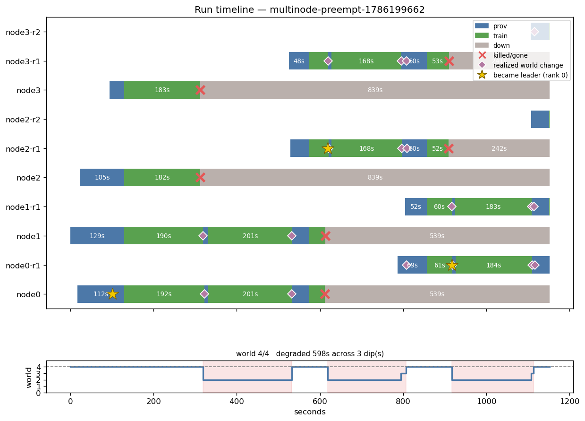
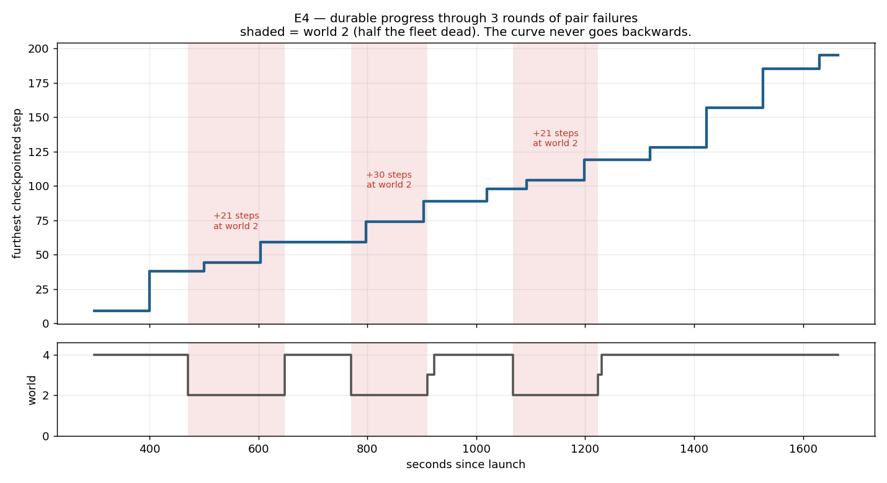
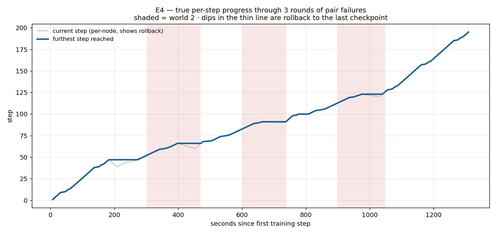

# E4 — rolling pair failures: 6 kills, 3 rounds, zero degradation

**Verdict: PASS on every criterion.** Half a 4-node world destroyed three times in
a row — including the master, and including replacements — and recovery cost did
**not** grow. Each round banked exactly the same amount of work.

Run `multinode-preempt-1786199662` · 900s training budget · **$1.84, 27.8 min**.

```
round 1  t+120s  kill 2,3  ->  survivors 0,1  ->  recover to 4
round 2  t+420s  kill 0,1  ->  survivors 2,3  ->  recover to 4   (the MASTER dies)
round 3  t+720s  kill 2,3  ->  survivors 0,1  ->  recover to 4   (kills round 1's REPLACEMENTS)
```

## The diagram



Ten node rows: four originals plus six replacements (`·r1`, `·r2`). The world
track shows **three clean dips — `degraded 598s across 3 dip(s)`** — and every
survivor row is **green straight through them** (201s, 183s, 184s of training at
world 2, not idling).

Two details worth catching:

- **The leader star moves three times** — `node0` → `node2·r1` → `node0·r1`.
  Master re-election happened twice, unprompted, because round 2 killed node 0.
- **Round 2's dip is two-stage** (`2 → 3 → 4`). The replacements registered at
  different moments and the supervisor grew the world as each became ready
  rather than waiting for both — so capacity returned sooner than a
  wait-for-all policy would have allowed.

## Durable progress over time



`ckpt_step` from the supervisor's own status history — already timestamped, so
nothing is reconstructed. It is the **furthest step that survives a failure**,
which is the number that actually matters.

**The curve never goes backwards, and it climbs inside every shaded window.**

| world-2 window | ckpt_step | rate |
|---|---|---|
| t+470..648s | 38 → 59 (+21) | 0.118 steps/s |
| t+771..910s | 59 → 89 (+30) | 0.215 steps/s |
| t+1068..1223s | 98 → 119 (+21) | 0.135 steps/s |
| **world 4 reference** | 119 → 195 (+76) | **0.190 steps/s** |

Half the fleet dead costs roughly a third to a half of the step rate, not all of
it — gradient accumulation holds the global batch at 480, so two nodes do the
same work per step, just with more micro-batches each. (The middle window's
0.215 exceeds the world-4 reference because that reference spans checkpoint
stalls; treat the three world-2 rates as the comparable set.)

Per-step rollback at each membership change is small and bounded by the
checkpoint interval — node 0's log shows `steps 1..47` then a resume at 38, then
`39..66` then a resume at 59: **9 and 7 steps**, ~30s of work at ~3s/step.

> A first version of this plot was reconstructed by anchoring step lines to
> `training` events and cumulatively summing `ms/step`. It showed false plateaus,
> because node index 0 has training events from both the original box and its
> replacement and the segments were mis-assigned. `ckpt_step` needs no
> reconstruction and is what the supervisor actually acts on.

### Per-step granularity



`ckpt_step` above moves only every ~30s. This is every logged step, placed in wall
clock by anchoring each log segment to its `training` event — those events carry
`{node, epoch}`, so original boxes and their replacements are never confused, and
only one clock is used. All 219 step lines are placed, none dropped, and the final
step is 195, matching `metrics.json`.

**Progress is essentially continuous.** The thin line is the current step (per
node) and the thick line the furthest reached. There are exactly **two rollbacks
of any size — 8 steps and 6 steps** — each bounded by the 30s checkpoint interval
at ~3s/step. The slope flattens inside the shaded world-2 windows but never
reaches zero.

Shaded spans here are approximate: they are placed in the training-event clock,
whereas the epoch boundaries were recorded in the status clock. Slope changes are
the reliable indicator, not the exact edges.

**For future runs: put a timestamp on the step log line.** Every reconstruction
above exists only because `step N: loss …, Nms/step` has none, and a first
attempt at this plot was wrong precisely because of that.

## The headline: recovery does not degrade

| round | `T_restart` | world-2 window | idle after regrow | **steps banked** |
|---|---|---|---|---|
| 1 | 9.9s | 201.0s | 42.1s | **21** |
| 2 | 7.9s | 168.5s | 60.2s | **21** |
| 3 | 7.8s | 184.3s | — | **21** |

Every prior measurement was a *single* failure, so nothing showed whether the
Nth recovery costs more than the first. **It does not.** `T_restart` is flat
(9.9 / 7.9 / 7.8s — the first is marginally slower, consistent with warm caches
afterwards), and the world-2 windows differ only by replacement boot jitter.

## The work is banked — identically, every round

Resume points prove reduced-world training was kept, not redone:

```
round 1   shrink resumed @ step 38  ->  regrow resumed @ step 59   = 21 steps banked
round 2   shrink resumed @ step 68  ->  regrow resumed @ step 89   = 21 steps banked
round 3   shrink resumed @ step 98  ->  regrow resumed @ step 119  = 21 steps banked
```

If the reduced-world work were being discarded, each regrow would resume at the
same step its shrink did — which is exactly what the pre-E2b runs did.

## Results

| metric | value |
|---|---|
| steps | 195 |
| val_loss | 5.6473 |
| `trained_seconds_total` | **901.74** (budget 900) |
| `resumed` / `restart_count` | True / 0 |
| final `world_size` | 4 |
| **whole-group restarts** | **0** |
| instances used | **10** = 4 + exactly 1 per kill |
| wall clock | 1667.8s |
| cost | $1.84 |

Epoch progression, clean throughout:
`1 [0,1,2,3] → 2 [0,1] → 3 [0,1,2,3] → 4 [2,3] → 5 [0,2,3] → 6 [0,1,2,3] →
7 [0,1] → 8 [0,1,3] → 9 [0,1,2,3]`

- W&B — https://wandb.ai/bot-developer3-Miguel%20Aenlle/spot-train/runs/5kdn29l3

## The risk that did not fire

Three rounds × 2 epochs = 6 epoch publications, against
`max_epochs_without_progress = 6`. The plan flagged this as safe *only* because
checkpoints land between rounds and reset the counter — and if the floor fired
anyway, that would have been the finding.

**It did not fire.** Checkpoints landed in every window (the banking above proves
it), the counter reset each round, and the floor stayed dormant across six kills.

> Reporting note: an early automated check said `1` whole-group restart. That was
> the collector's `grep -ci "whole-group restart"` matching the driver's own
> warning banner about this risk, not a supervisor event. Grepping for the actual
> emitted string (`[supervisor] whole-group restart`) returns **0**.

## What this run covers that earlier ones did not

| | covered by | E4 |
|---|---|---|
| single node loss | E2b | — |
| all nodes at once | total-loss expt | — |
| **half the world, repeatedly** | — | ✅ 3 rounds |
| **master dying as part of a pair** | — | ✅ round 2 |
| **killing a replacement** | — | ✅ round 3 kills round 1's `·r1` boxes |
| **does recovery cost accumulate?** | — | ✅ answered: no |

## Validity

- `trained_seconds_total` 901.74 against a 900s budget — honoured across six kills
- 10 instances = 4 + exactly one replacement per kill; no churn, no crash loops
- `restart_count=0`, `resumed=True`, zero whole-group restarts
- reduced-world counts and resume points read from **raw node logs**, not
  `profile.json` (which dedupes by step and drops rolled-back work)
- driver ran under a `trap reap` guard; fleet terminated, 0 instances billing

## Driver

`.context/e4/rolling_pairs.py`. A bespoke driver was necessary because
`multinode-preempt` builds `[((k+1)*interval, victims[k]) ...]` — one victim per
entry at strictly increasing times — so it cannot express a simultaneous pair,
and a stagger would leave three survivors and quietly become the already-measured
single-node case. The schedule builder is unit-tested with no AWS: three rounds,
both victims sharing one timestamp, master included in round 2, all four indices
covered.
