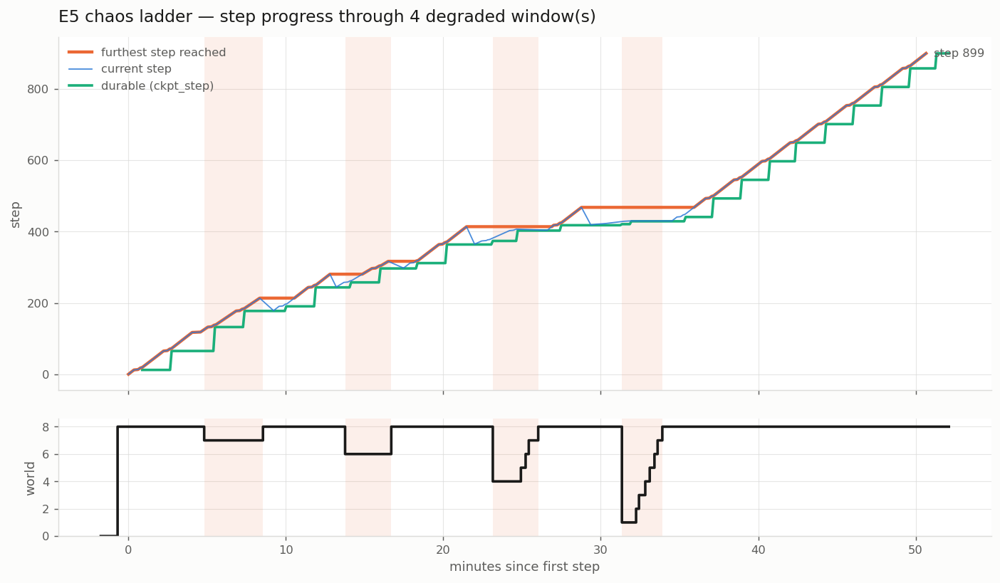

# E5 — 8-node chaos ladder: recovery cost does not scale with failure size

**Verdict: PASS.** Four escalating failures in one run — **k = 1, 2, 4, 7 of 8** —
and the degraded window did not grow. Losing seven of eight nodes recovered in
*less* wall clock than losing one. Zero whole-group restarts, zero human
intervention, every round banked work.

Run `multinode-preempt-1786207072` · 2100s training budget · **$7.34, 55.6 min**
· seed `20260808`.

```
round 1  t+197s  kill 1 of 8  ->  world 7  ->  recover to 8
round 2  t+716s  kill 2       ->  world 6  ->  recover to 8
round 3  t+1240s kill 4       ->  world 4  ->  recover to 8   (half the fleet)
round 4  t+1676s kill 7       ->  world 1  ->  recover to 8   (ONE node left)
```

Victims, kill times (±60s) and the k=7 survivor were drawn from a seeded RNG.
The draw put **node 0 in all four rounds** (p ≈ 1.4%) — not re-rolled, because
seed-shopping would forfeit the point. It means every round also killed the
master, so master re-election is exercised throughout and held constant.

## The diagram



Two panels, one shared time axis — deliberately **not** a dual-axis chart. Top:
current step (thin) against furthest reached (thick); a gap between them *is* a
rollback. Bottom: the world-size staircase, with degraded spans shaded.

The two large rounds are visible as staircases climbing back — `8→4→5→6→7→8` and
`8→1→2→3→4→5→6→7→8`. **The furthest-step line climbs through all four windows.**
It flattens inside them; it never reaches zero, including at world 1.


## The headline: recovery is k-independent

| round | k | world | **degraded window** | detect | kill→world 8 | ckpt gain |
|---|---|---|---|---|---|---|
| 1 | 1 | 7 | **224.0s** | 37.1s | 261.1s | +178 |
| 2 | 2 | 6 | **176.0s** | 58.1s | 234.1s | +120 |
| 3 | 4 | 4 | **173.0s** | 97.2s | 270.2s | +54 |
| 4 | **7** | **1** | **154.0s** | 153.1s | 307.1s | +481 |

**Seven times the nodes lost, and total recovery grew 261s → 307s (+18%).** The
degraded window itself *shrank*. This is the question E5 existed to answer, and
it is the direct refutation of the pre-fix 8-node behaviour, where four kills
serialised into 87s of dead time before survivors could resume at all.

Do **not** read this as "recovery improves with k." Four points, and the poll has
gaps during recovery. The window is bounded by *one* replacement boot regardless
of how many are booting, so 154–224s is boot jitter. The defensible claim is
**k-independence**, not an inverse relationship.

`detect` is the one term that clearly grows with k (37s → 153s). That is mostly
an artifact of the driver issuing `TerminateInstances` serially — a real
simultaneous preemption would not pay it.

## Correcting something I said mid-run

While the run was live I claimed replacements "boot in parallel, so k replacements
cost the cost of the slowest one." **The launches are not parallel.** Relaunch
spans were 0 / 17.5 / 53.7 / 105.7s for k = 1 / 2 / 4 / 7 — a steady **~17.6s per
launch**, essentially the same serialization rate as the old broken run's 18.8s.

What actually changed is subtler and more important: the **shrink epoch now
publishes before any replacement launches**, so survivors no longer wait on them.

```
terminated node 0,1,4,7
published epoch 6: members [2,3,5,6]   <- survivors resume HERE
launching replacement for node 0        <- serialized launches follow
launching replacement for node 1
```

In the pre-fix run, `shrink_resume` landed *exactly* on the last relaunch. The
fix decoupled survivor restart from launch, not launch from launch. Boots overlap
once started, which is why a 105.7s launch spread still yields the shortest
degraded window in the set.

## Throughput at reduced world tracks N/8 almost exactly

| world | median s/step | rate vs ws8 | ideal N/8 | **predicted** |
|---|---|---|---|---|
| 8 | 1.75 | 1.00 | 1.00 | — |
| 7 | 2.01 | **0.87** | 0.875 | 0.93 |
| 6 | 2.26 | **0.77** | 0.75 | 0.86 |
| 4 | 3.03 | **0.58** | 0.50 | 0.70 |
| **1** | 11.32 | **0.15** | 0.125 | 0.25 |

**Every prediction in this table was wrong, and all in the same direction** — I
forecast a super-linear bonus from reduced communication at every world size.
There isn't one at 7 or 6; measured tracks `N/8` to within 2 points.

It appears only where communication actually disappears: **world 4 runs 16% above
proportional and world 1 runs 26% above**, because a 1-rank group does no
allreduce at all.

The useful reading is still positive: **reduced-world training carries no
efficiency penalty beyond the nodes you lost.** But the model's `ETA = 0.653`
(fit at a single point) understates degraded-window step loss by ~35%; the correct
value is ≈1.0 at worlds 6–7, rising modestly at very small worlds.

## The constant this run existed to measure

`RESTART_SCALE_8N` — how much costlier an 8-rank world re-formation is than a
4-rank one. **Assumed 1.3. Measured 1.65–1.84**, depending on the baseline:

| clean-8n baseline | clean wall | overrun | per event | **scale** |
|---|---|---|---|---|
| E5's own `provisioning_s` (262.8s — *includes 14 replacement launches*) | 2415.6s | +920.9s (+38.1%) | 230.2s | **1.65** |
| clean-ladder `provisioning_s` (182.5s — 8 boxes only) | 2335.3s | +1001.2s (+42.9%) | 250.3s | **1.84** |

The second row is the honest one: using E5's own provisioning inflates the
baseline with replacement launches and flatters the result. **Take
`RESTART_SCALE_8N ≈ 1.8`, ~40% above the guess.**

Per node lost: **71.5s**, against E4's 79.9s at 4 nodes — so the *per-node* cost
is slightly better at 8 nodes even though the per-event cost is higher.

## Results

| metric | value |
|---|---|
| steps | 899 |
| val_loss | **3.9806** (from 10.98 at step 1) |
| `trained_seconds_total` | **2100.04** (budget 2100) |
| `resumed` / `restart_count` | True / 0 |
| **whole-group restarts** | **0** |
| epochs published | 18 |
| instances | **22** = 8 + exactly 1 per kill |
| wall clock | 3336.5s (55.6 min) |
| cost | **$7.34** (estimated $7–9) |
| step lines | 1097, **100% timestamped** |

World progression: `8 → 7 → 8 → 6 → 8 → 4 → 5,6,7 → 8 → 1 → 2,3,4,5,6,7 → 8`.

## Things that worked because they were fixed first

**The timestamped step log.** All 1097 step lines carry wall clock, so every
number here is *read*, not reconstructed. E4's plots were rebuilt by summing
`ms/step` and two were wrong before they were right. That class of error is gone.

**`MAX_EPOCHS_WITHOUT_PROGRESS` raised 6 → 12.** Round 3 published 5 epochs and
round 4 published 8; `ckpt_step` sat unchanged across 3 consecutive publications
in round 3. **The default of 6 would have fired**, and its penalty is discarding
every healthy survivor. This was the single required code change and it earned
itself.

**World 1 works.** A single node became its own master, formed a 1-rank group,
trained at 11.3s/step, *and checkpointed* (`ckpt_step` 421 → 429). The most
plausible failure mode of the whole ladder simply did not occur.

## A reporting bug this run exposed (fixed)

The first render of the timeline **stopped at 2239s of a 3336s run**, hiding the
final 1097s of full-world training. The last replacements drew as `prov` plus
world-change diamonds with no training bar — a healthy fleet rendered as a
stalled one, which is exactly how it was first read.

Cause: `_render_run_timeline` took `now = max(event ts)`, and events are emitted
only on **state transitions** (kill, relaunch, epoch change). A run that recovers
and then trains quietly to the end emits nothing for that stretch, so the chart
ended at the last epoch publication.

Fixed by giving `_render_run_timeline` an `end_ts` argument and passing the run's
real completion time (launch + `durations.total_s`). The corrected chart shows
all eight final replacements training **1064s** each, to the end.

Worth stating plainly because the failure mode is asymmetric: the truncated chart
did not look broken, it looked like *the system* was broken. Any timeline whose
extent is derived from event data has this hazard.

## An observability gap worth fixing

**`status.json` goes stale during recovery.** `updated_at` showed a 24s hole
spanning the epoch-2 transition, because the supervisor loop blocks on the
synchronous replacement launch. On a 36h run `orch status` would appear frozen
exactly when an operator is most likely to be looking at it.

It cost nothing here only because the step log carries its own clock. Worth
either moving launches off the loop or writing `status.json` before launching.
Filed in `docs/backlog.md`.

## Rollbacks land at regrows, not shrinks

Visible in the plot, and consistent with the two-tier checkpoint design: a
survivor restarts from a **node-local** checkpoint that is current, while a
joining replacement can only load the **S3** one, which lags. Six rollbacks
across four rounds, each bounded by the effective checkpoint cadence.

The k=7 round banked **+481 steps** of durable progress across its window — the
largest of the four, because its degraded period was long enough to cross several
checkpoint cycles.

## Validity

- `trained_seconds_total` 2100.04 against a 2100s budget — honoured across 14 kills
- 22 instances = 8 + exactly one replacement per kill; no churn, no crash loops
- `restart_count=0`, `resumed=True`, zero whole-group restarts
- every traceback is an NCCL peer-exit signature (`remote process exited`) from
  the kills themselves — no unexpected exception types
- reduced-world step counts read from **raw node logs**, not `profile.json`
- driver ran under `trap reap_ours` (region + tag scoped); **fleet verified at 0**,
  us-east-2 untouched

## Feeding the 36h projection

Three of the model's constants are now measured rather than guessed:

| constant | was | **now** |
|---|---|---|
| `RESTART_SCALE_8N` | 1.3 (guess) | **~1.8** |
| `ETA` (degraded throughput) | 0.653 | **≈1.0** |
| recovery vs k | assumed k-dependent | **k-independent** |

The first two push the 36h estimate the *same* direction (worse), the third
pushes it better. Net effect on the headline still needs recomputing — the
scenario tables in `docs/e5-8node-chaos-plan.md` should be regenerated against
these numbers before any of them are quoted.

**Do not read this run's 62.9% goodput as the 36h figure.** Four destructive
events inside 35 minutes of training is a stress-test rate ~50× what the 36h plan
schedules; fixed recovery cost is amortised over 60× more training there.

## Reproducing

```bash
set -a && . ./.env && . ./recipes/gpt2-owt.env && set +a
export MARKET=on-demand NODES=8 MAX_EPOCHS_WITHOUT_PROGRESS=12 CHAOS_SEED=20260808
python3 .context/e5/chaos_ladder.py --dry-run   # prints the exact schedule
python3 .context/e5/collect.py <run_id> --fetch # per-round table
python3 .context/e5/plot_progress.py            # the diagram above
```
