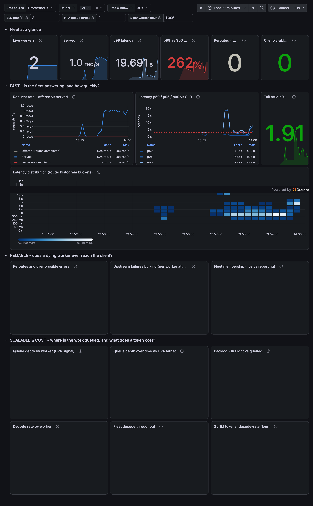

# P3.2 results — the fleet on Kubernetes (k3d)

**Run:** 2026-08-08 · **Cost: $0** · **AWS resources used: none** — no credentials
loaded, no API calls, in any region.
**Plan:** [hf-kv-k3s-plan.md](./hf-kv-k3s-plan.md) · **Baselines:**
[x2-x3-results.md](./x2-x3-results.md)
**Cluster:** k3d v1.35.5+k3s1, 1 server + 2 agents, all containers on one
laptop. Workers serve stock `gpt2` (124M) on CPU through the HF/KV-cache backend.

---

## Headline

| Check | Result |
|---|---|
| **a — discovery** | ✅ Router finds workers via the headless Service's DNS records, with the heartbeat backend **provably off** |
| **b — contract** | ✅ Response JSON **identical** to the bare-process baseline |
| **c — chaos under load** | ✅ **0 client-visible errors** across 90 requests, `rerouted=1` |
| **d — self-heal** | ✅ Killed pod replaced with no human action |
| **e — detection latency** | ✅ **0.83 s graceful / 4.65 s abrupt**, vs **13 s** for heartbeats |
| **f — observability** | ✅ Prometheus scrapes the router; Grafana auto-loads the dashboard |



---

## What changed to get here

**Images.** Router is Go on distroless static — **12.6 MB**, no shell, nothing to
exec into. Worker is 1.17 GB (torch dominates). One Dockerfile with `BASE_IMAGE`
as an ARG so the CPU and CUDA variants cannot drift apart.

**A new discovery backend.** The Go router had `Dir` and `S3` registries but
nothing for Kubernetes. Rather than take on client-go, RBAC and a
ServiceAccount, it gained a `dns://` backend: a headless Service publishes one A
record per **Ready** pod, so the kubelet's probe decides membership.

Honest about the mechanism: this still **polls** (every `ROUTER_POLL_SECONDS`),
so it is not push. The win is the *source of truth* — kubelet probes instead of
workers self-reporting — not the transport.

---

## a — discovery is falsifiable, not assumed

The workers run with `FLEET_WORKERS_URI=""`, so the heartbeat path is off on
both sides. If the router still sees workers, DNS is necessarily the mechanism —
there is no other path.

```
router: FLEET_WORKERS_URI=dns://fleet-worker:8001
worker: FLEET_WORKERS_URI=""            (heartbeat disabled)

/fleet/status -> live_workers: 2
   10.42.0.8:8001   10.42.1.4:8001      (pod IPs, not heartbeat docs)
```

## b — containerization changed nothing

Diffed against the response captured from the **bare process** in X2:

```
top-level  : IDENTICAL   choices[0] : IDENTICAL   usage : IDENTICAL
```

Text also matches the greedy baseline exactly:
`" the capital of the French Republic, and the capital of the French Republic is the"`.

## c — kill a pod under load

First attempt was run at 2 rps and is **not** reported as a pass: the fleet was
saturated (53 dropped, p50 13 s), so "0 errors" would have been measured on a
fleet that was already failing to keep up. Re-run at 1 rps — half of measured
capacity:

| | saturated (rejected) | healthy load |
|---|---|---|
| errors | 0 | **0** |
| dropped | 53 | **1** |
| p50 | 13,016 ms | **691 ms** |
| rerouted | 8 | **1** |

Per-second view around the kill at t=30 — **no error spike at all**:

```
 t  sent  ok  err drop   p99ms
 29     1   1    0    0     957
 30     1   1    0    0     985  <-- KILL (--force --grace-period=0)
 31     1   1    0    0     787
 32     1   1    0    0     678
 ...
 39     1   1    0    0    1653
 40     1   1    0    0    1592
```

Total client-visible errors across the whole run: **0**.

**The interesting part is where the latency bump is.** It is not at t=30 (the
kill) — it is at t=39–41, when the *replacement pod* loads its model and
competes for CPU. The cost of the failure was not losing a worker; it was
starting a new one.

## d — self-heal

`live_workers` returned to 2 within the 90 s run with no human action. Nothing
equivalent exists in the heartbeat/EC2 path, where a dead worker stays dead
until the orchestrator is told.

## e — detection latency (the reason to adopt K8s)

Measured against X2's **13 s** heartbeat TTL. Probe config is deliberately
modest — `periodSeconds=2`, `failureThreshold=2`, `ROUTER_POLL_SECONDS=1` —
rather than tuned to flatter Kubernetes, and is reported so the number is
reproducible.

| Failure mode | Detection | vs 13 s heartbeat |
|---|---|---|
| **Graceful** (`kubectl delete pod`) | **0.83 s** | **15.7× faster** |
| **Abrupt** (`--force --grace-period=0`) | **4.65 s** | **2.8× faster** |

Both modes are reported because conflating them would rig the result. A graceful
delete removes the pod from the Service *before* it dies — something heartbeats
structurally cannot do, since a dying worker cannot publish its own departure.
The abrupt number is the honest apples-to-apples one, and it lands exactly where
the probe config predicts (2 s × 2 + 1 s poll ≈ 5 s).

## f — observability

`kube-prometheus-stack` 88.2.0, Grafana 13.1.3.

- Scrape target `fleet-router` → **UP**, 16 active targets, **0 down**
- **No `kube-etcd` / `kube-scheduler` / `kube-controller-manager` / `kube-proxy`
  scrape pools** — k3s runs the control plane as a single process, and the
  chart's defaults would have alerted permanently on components that are fine
- Dashboard **auto-provisioned** from the ConfigMap sidecar (`OptiTrain -
  Inference Fleet`), never hand-built in the UI

Metrics reconcile exactly against the router's own counters:

```
fleet_router_requests_total{outcome="ok"}        101
fleet_router_requests_total{outcome="rerouted"}    1     = 102 requests
fleet_router_live_workers                          2
histogram_quantile(0.99, ...)                   2.94 s
fleet_worker_queue_depth{worker_id="...kkclj"}     0
sum(nonexistent_metric_total) or vector(0)         0     <- absent-as-zero works
```

That last line is the guard against Go's `client_golang` omitting metric
families with no children: a cold router returns *no data*, not zero, and naive
panels would show the fleet as broken after every restart.

---

## Three things the cluster taught us that reading would not have

**1. `runAsNonRoot` rejects distroless.** The base sets `USER nonroot` — a
*name* — and the kubelet refuses what it cannot verify:
`"image has non-numeric user (nonroot), cannot verify user is non-root"`.
Fixed with an explicit `runAsUser: 65532`.

**2. torch does not read its cgroup limit.** Each worker pod spawned one thread
per **host** core, so the pods thrashed: **~1.2 tok/s** per worker, versus
~85 tok/s for the same model outside a container. Capping `OMP_NUM_THREADS` to
the CPU request took a 16-token completion from **~13 s to ~0.7–1.8 s**. The
same trap applies on the GPU nodes.

**3. Kubelet image GC will evict your images.** Docker's VM sat at 82 %, the
kubelet tainted every node `disk-pressure`, and after reclaiming space it had
already garbage-collected the imported images out from under the pods
(`ErrImagePull`). Reclaimed ~18 GB of build cache and dangling layers; the
cluster then came up clean.

---

## What this does NOT establish

1. **Nothing about multi-node.** k3d "nodes" are containers sharing one host
   network stack. Cross-node pod networking, and the flannel VXLAN UDP 8472 rule
   that goes with it, are untested. That is P3.3.
2. **The black-hole failure mode is still unverified.** `delete pod` on a local
   container yields an immediate connection refusal. A terminating EC2 instance
   **silently drops packets**, which is what the 3 s connect timeout and
   `ROUTER_UPSTREAM_KEEPALIVE=false` exist for. Untested since X2, and only
   testable against a real instance.
3. **No GPU.** `nvidia.com/gpu`, the device plugin and the CUDA image are all
   unexercised.
4. **No performance claim.** CPU workers in containers on a contended laptop.
   `L0`, `C1`, tokens/s and $/1M tokens come from E1/E2 on a g5.xlarge. The
   dashboard's p99 sits *above* the 3 s SLO for exactly this reason — the SLO is
   a placeholder until E1 measures `L0`.
5. **The screenshot is partial.** Grafana lazy-renders panels outside the
   viewport, so the two lower rows are blank in a full-page capture even though
   their queries return data (verified directly against Prometheus). A complete
   image needs scrolled captures.
6. **No GPU metrics exist yet.** `kube-prometheus-stack` provides none, and GPU
   utilisation is *the* metric for an inference platform — it is what would prove
   batching works. The worker already collects `gpu_util`/`gpu_mem` in `/stats`;
   wiring those into Prometheus gauges is a small, unstarted piece of work.

---

## Reproduce

```bash
./deploy/docker/build.sh                    # native arch, CPU worker
k3d cluster create fleet --agents 2
k3d image import fleet-router:dev fleet-worker:dev -c fleet
kubectl apply -k deploy/k8s/local

helm install optitrain prometheus-community/kube-prometheus-stack \
  --version 88.2.0 -n monitoring --create-namespace -f deploy/monitoring/values.yaml
kubectl apply -f deploy/monitoring/servicemonitor-router.yaml
kubectl apply -f deploy/monitoring/dashboard-configmap.yaml
```

⚠️ `build.sh --cloud` is mandatory for anything bound for EC2: this repo is
developed on arm64 and deployed to amd64, and a native-arch image runs fine in
k3d and then dies on a g5.xlarge with `exec format error`.
