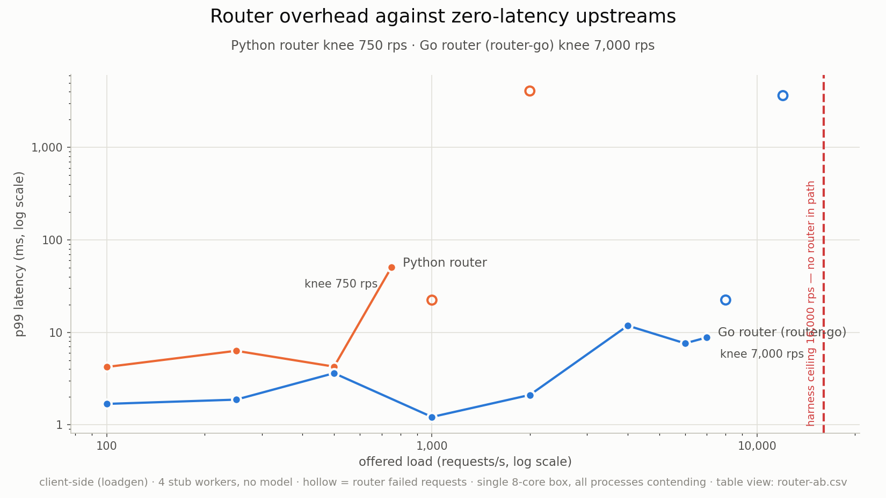

# X2 / X3 results — router equivalence and router overhead

**Run:** 2026-08-08 · **Cost:** $0 · **AWS resources used: none** (no credentials
loaded, no API calls, no instances — in any region).
**Plan:** [local-validation-plan.md](./local-validation-plan.md)
**Machine:** macOS, 8 cores, 17.2 GB RAM. Every process (loadgen, router,
workers) shares that one box.

X1 (`gpt2-xl`) is **not** in this document — see [Deferred](#deferred) below.

---

## Headline

| | Result |
|---|---|
| **X2 — equivalence** | The Go router matched the Python router on **every** behavioural check, and the JSON contracts are key-for-key identical. Two cosmetic exposition deltas, one with an operational consequence. |
| **X3 — overhead** | Go sustains **7,000 rps vs 750 rps** — **9.3× the throughput** — and adds **~3× less latency** per request at matched load. |



Table view: [`router-ab.csv`](./router-ab.csv)

---

## Setup

A correctness detail that nearly invalidated the whole run: this repo's editable
install (`__editable__.spot_train-0.0.1.pth`) points at a **different worktree**
(`san-antonio/src`). Importing `inference` without an override silently loads
that tree's code, which has none of this branch's changes. Every process here was
launched with `PYTHONPATH=<this worktree>/src`, verified before starting:

```
default:            .../san-antonio/src/inference/__init__.py     ← wrong tree
PYTHONPATH override: .../inference-go-k8s/src/inference/__init__.py  ✓ ServeSettings present
```

Both routers were driven by **one script** (`.fleet/x2x3/battery.sh`) so the two
runs are step-for-step identical, and both read the same `FLEET_WORKERS_URI`
registry directory — confirmed from `router-go/README.md` rather than assumed.

---

## X2 — router functional equivalence

Two `gpt2` (124M) workers on :8001/:8002, left running and untouched; only the
router on :8000 was swapped.

| Check | Python | Go | Match |
|---|---|---|---|
| Workers discovered | 2 | 2 | ✅ |
| Round-robin spread (10 requests) | 5 / 5 | 5 / 5 | ✅ |
| 4xx passthrough (`max_tokens=0`) | 422, `rerouted_delta=0` | 422, `rerouted_delta=0` | ✅ |
| **Reroute on `kill -9`** | **6 ok, 0 errors**, 3 rerouted | **6 ok, 0 errors**, 3 rerouted | ✅ |
| Dead worker dropped | 13 s (TTL 15 s) | 13 s | ✅ |
| No workers → 503 | 503 | 503 | ✅ |

### JSON contracts — key-for-key identical

```
/fleet/status    ["failed","last_poll","live_workers","requests","rerouted","workers"]
/fleet/metrics   ["router","stats_ts","ts","workers"]
/v1/completions  ["choices","created","id","model","object","usage","worker_id"]
  choices[0]     ["finish_reason","index","logprobs","text"]
  usage          ["completion_tokens","prompt_tokens","total_tokens"]
```

Histogram buckets identical: `0.05 0.1 0.25 0.5 1 2 3 5 8 12 20 30 60 +Inf`.

### Two exposition deltas

**1. Zero-child metric families (has an operational consequence).**
On a freshly started router with no traffic, Go's `/metrics` omits
`fleet_router_requests_total` and `fleet_router_upstream_attempts_total`
entirely; Python emits their `# TYPE` headers with no samples. This is a client
library convention — `client_golang` drops metric families with no children,
`prometheus_client` does not. Confirmed **not** a bug: after traffic the Go
router exposes them, internally consistent with the battery it had just served:

```
fleet_router_requests_total{outcome="ok"}        14
fleet_router_requests_total{outcome="rerouted"}   3
fleet_router_requests_total{outcome="failed"}     1     # = 18 requests, exactly what ran
fleet_router_upstream_attempts_total{result="error",worker_id="w1"}         3   # the killed worker
fleet_router_upstream_attempts_total{result="client_error",worker_id="w2"}  1   # the 422
```

> **Consequence for the dashboard:** a Grafana panel or alert querying these on a
> cold Go router gets **"no data"**, not `0`. Panels must be built to treat absent
> as zero, or the fleet will look broken every time it restarts. Worth fixing in
> the dashboard JSON rather than discovering during a demo.

**2. Content-type suffix.** Go sends
`text/plain; version=0.0.4; charset=utf-8; escaping=values`; Python omits
`escaping=values`. Both are valid Prometheus exposition; scrapers accept either.
Cosmetic.

### ⚠️ What X2 did *not* exercise

The `kill -9` was on **localhost**, where a dead process yields an immediate
`ECONNREFUSED`. A terminating EC2 instance **black-holes packets instead**, which
is the case the 3 s connect timeout and `ROUTER_UPSTREAM_KEEPALIVE=false` exist
to bound. **That path is still unverified** and can only be tested against a real
instance being terminated (E7). Do not read X2 as validating it.

---

## X3 — router overhead

Four Go stub workers (`bench/stubworker`) answering `/v1/completions`
immediately. With upstream latency ≈ 0, essentially all measured latency is the
router. Stubs are Go, not Python, so the stub can't be the bottleneck.

### Control: the harness ceiling

Before trusting any knee, loadgen was pointed **directly at a stub, no router**:

| Offered | Achieved | p99 | Errors |
|---|---|---|---|
| 4,000 | 4,000/s | 0.19 ms | 0 |
| 8,000 | 7,999/s | 3.01 ms | 0 |
| 12,000 | 11,997/s | 1.11 ms | 0 |
| **16,000** | **15,995/s** | **0.91 ms** | **0** |

The client sustains ≥16,000 rps cleanly — **2.3× above the Go knee**, so both
knees below are the routers' limits, not the harness's.

### Python router

| Offered | Achieved | p50 | p99 | Errors | Dropped |
|---|---|---|---|---|---|
| 100 | 100/s | 2.38 ms | 4.23 ms | 0 | 0 |
| 250 | 250/s | 1.60 ms | 6.32 ms | 0 | 0 |
| 500 | 500/s | 1.15 ms | 4.26 ms | 0 | 0 |
| **750** | **750/s** | 0.89 ms | 50.37 ms | **0** | 0 |
| 1,000 | 766/s | 0.78 ms | 22.34 ms | **1,511** | 230 |
| 2,000 | 78/s | 2,069 ms | 4,082 ms | **6,043** | 13,120 |

**Knee: 750 rps.** Note the p99 had already degraded 12× (4.26 → 50.37 ms)
*before* errors appeared — the tail warns one step ahead of the failure.
Collapse at 2,000 rps is total: throughput falls to 4% of offered.

### Go router

| Offered | Achieved | p50 | p99 | Errors | Dropped |
|---|---|---|---|---|---|
| 100 | 100/s | 0.87 ms | 1.69 ms | 0 | 0 |
| 500 | 500/s | 0.45 ms | 3.62 ms | 0 | 0 |
| 1,000 | 1,000/s | 0.34 ms | 1.22 ms | 0 | 0 |
| 2,000 | 2,000/s | 0.26 ms | 2.11 ms | 0 | 0 |
| 4,000 | 3,999/s | 0.14 ms | 11.83 ms | 0 | 0 |
| 6,000 | 5,999/s | 0.12 ms | 7.61 ms | 0 | 0 |
| **7,000** | **6,999/s** | **0.12 ms** | **8.82 ms** | **0** | 0 |
| 8,000 | 5,506/s | 0.13 ms | 22.41 ms | **1,175** | 19,577 |
| 12,000 | 1,027/s | 0.67 ms | 3,643 ms | **4,643** | 104,577 |

**Knee: 7,000 rps.**

### Comparison

| Metric | Python | Go | Ratio |
|---|---|---|---|
| **Zero-error knee** | 750 rps | **7,000 rps** | **9.3×** |
| p50 @ 100 rps | 2.38 ms | 0.87 ms | 2.7× |
| p50 minus stub baseline (0.13 ms) = router cost | 2.25 ms | **0.74 ms** | **3.0×** |
| p99 @ 100 rps | 4.23 ms | 1.69 ms | 2.5× |

Both fall off the same way once saturated — rising drops as the client can't
find a free slot, then collapse — but Go does it an order of magnitude later.

---

## What these results do and don't support

**Supported:**
- The Go router is a behaviourally faithful drop-in. Safe to run in the A/B arm.
- Go's routing overhead is ~3× lower and it saturates ~9× later, on this box.
- The **ratio** between routers, since both faced identical stubs, identical
  load, and identical contention.

**Not supported:**
1. **No absolute capacity claim.** loadgen, router, and 4 stubs contended for 8
   cores. Real numbers need them on separate boxes; expect the absolute knees to
   move. The ratio is the durable result.
2. **Nothing about model-serving performance.** Stubs do no inference. `L0`,
   `C1`, tokens/s and $/1M tokens come from **E1/E2 on a g5.xlarge**.
3. **Nothing about scaling.** Four stubs on one box is not horizontal scaling.
4. **Nothing about K8s.** These are bare processes; pod-kill is T4 on k3d.
5. **The black-hole failure mode is untested** (see the X2 warning above).
6. **The Python router was not tuned.** It ran default uvicorn with synchronous
   `requests`. A fairer statement is "as configured in this repo today," not
   "Python cannot do better."

---

## Deferred

**X1 (`gpt2-xl`) was not run**, and the plan's memory estimate was wrong in a way
that matters. nanoGPT's `from_pretrained` holds **two full copies** of the model
at once — it builds a nanoGPT `GPT` (6.2 GB) *and* loads HF's `GPT2LMHeadModel`
(6.2 GB) before copying weights across — so peak is **~12.4 GB**, not the 6–7 GB
the plan assumed. This machine had 0.9 GB free.

**This also threatens the GPU experiments: g5.xlarge has only 16 GiB of system
RAM**, and that peak occurs in CPU RAM before `.to(cuda)`.

Agreed follow-up: fix the loader (HF `low_cpu_mem_usage=True` + fp16, avoiding
the double allocation), then run X1 on an `r7i.xlarge` (32 GB, ~$0.27/hr) in
**us-east-2**.

---

## Reproduce

```bash
# X3 figure from the raw loadgen reports
python -m bench.plot_router_ab --indir .fleet/x2x3 --out docs/experiments
```

Raw reports live in `.fleet/x2x3/` (gitignored). All processes were killed and
ports :8000–:9004 verified free after the run.
